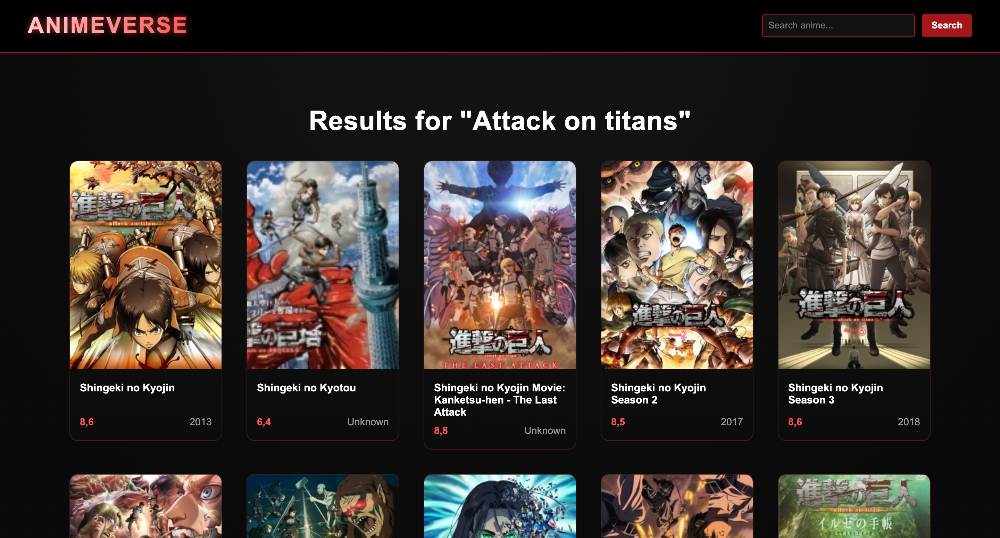
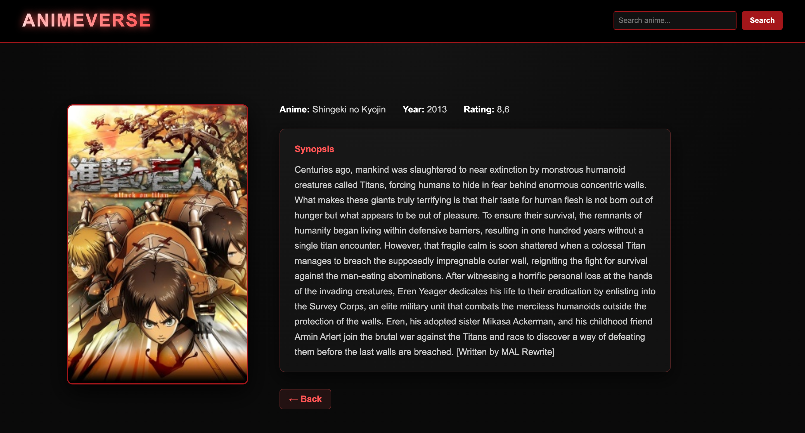

# AnimeVerse

AnimeVerse is a web application built with **ASP.NET Core MVC and C#** that allows users to search for Japanese anime and explore information such as title, rating, year and description.

The application fetches real-time data from the **Jikan API**, which provides access to a large anime database.

---

## Features

- Search for anime by title
- View detailed information (title, rating, year, poster and description)
- Automatically displays popular anime on the homepage
- Handles invalid or empty search queries
- Responsive UI built with HTML and CSS

---

## Screenshots

### Home Page

### Search

### Search Results

### Anime Details

---

## Tech Stack

- **C# (.NET 6)**
- **ASP.NET Core MVC**
- **Razor Views**
- **HTML & CSS**
- **xUnit** for unit testing
- **Jikan REST API**

---

## Architecture

The project follows a clean **MVC architecture** and applies several core C# and software design principles.

- **Model–View–Controller (MVC)**
- **Dependency Injection**
- **Factory Pattern**
- **Async / Await for API calls**
- **Service layer abstraction**

Key components:

- AnimeController – handles user requests
- AnimeService – communicates with the external API
- AnimeFactory – converts API JSON responses into domain models
- IAnimeService – interface used for loose coupling

---

## Testing

Unit tests are written using **xUnit** to verify the functionality of core components.

Tests include:

- **AnimeFactoryTests**  
  Verifies that JSON responses are correctly converted into **Anime** objects and handles missing data safely.

- **AnimeServiceTests**  
  Ensures that the service correctly returns data and properly handles API errors (such as 404 responses) using a mocked **HttpMessageHandler**.

---

## How to Run the Project

1. Clone the repository

2. Open the project in **JetBrains Rider** or **Visual Studio**

3. Run the application

## Developer

Younes Barka

GitHub
https://github.com/YounesBarka00

LinkedIn
https://www.linkedin.com/in/younes-barka-b5b45136a/
